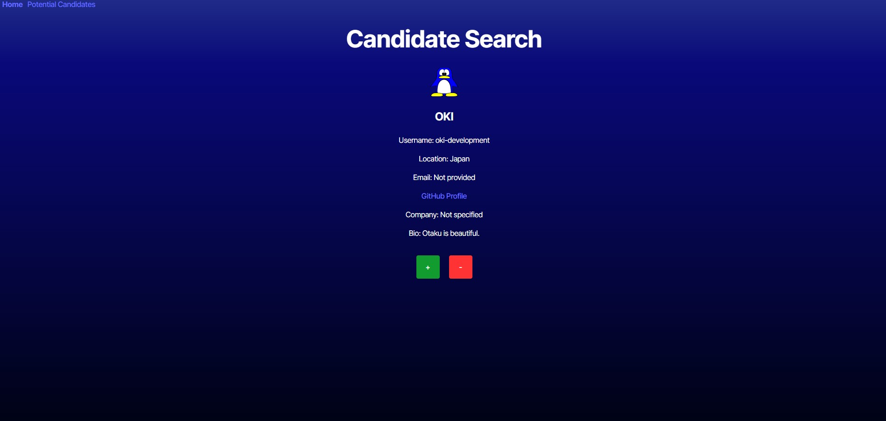
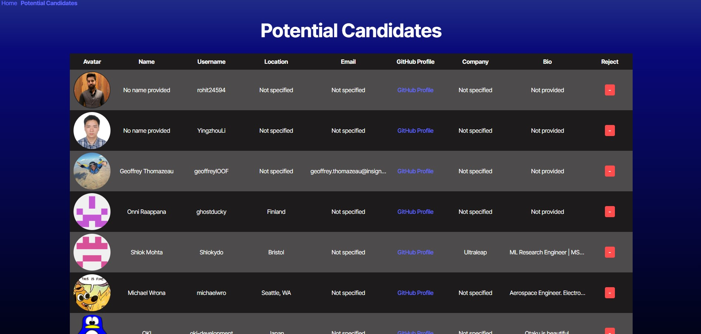

# Candidate-Search-App

## Description
I created this candidate search application to help employers find potential candidates to hire. It is meant to provide a quick an easy way to sift through multiple candidates by providing you with information from their GitHub accounts. There are buttons to either add or discard the current candidate and move on to the next one. If one is added, they get put on a potential candidates list for further review. Those cnadidates can be removed from the list at any time by clicking the reject button.

## Table of Contents
- [Installation](#installation)
- [Usage](#usage)
- [License](#license)
- [Contributing](#contributing)
- [Tests](#tests)
- [Questions](#questions)

## Installation
N/A

## Usage

Upon loading up the page you will be brought initially to the Homepage, or the Candidate Search page. This is where you will be provided with information on a candidate which include their, avatar or image, name, username, location, email, profile link, company, and bio. If you like a candidate simply click the green plus button and they will be added to the potential candidates list and the next candidate will load for you to review. If you don't like the candidate just press the red minus button and it will discard that candidate and load the next on for you to review.

When you are ready to review your potential candidates, simply press the potential candidates link at the top of the screen and you will be brought to a table containing a list of all of your saved candidates. After reviewing them you can either reach out to the candidates or reject them by pressing the red minus button. This will remove them from your list.

The Contact section provides a form for the user to fill out should they wish to reach out. Simply fill in all of the provided fields with the necessary information and click the submit button.

  ## License
    MIT
    
  https://opensource.org/licenses/MIT

## Contributing
At this time no further contributions are needed.

## Tests
N/A

## Questions
GitHub: [pauletters](https://github.com/pauletters)
Email: pauletters87@gmail.com